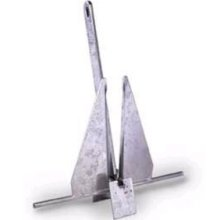
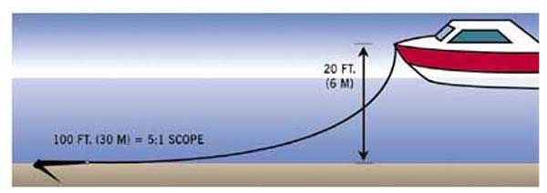
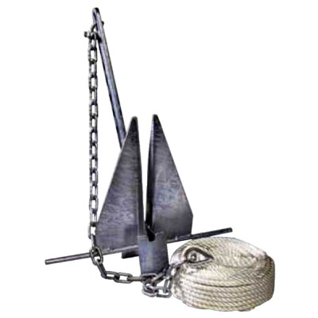

Anchor Basics
-------------

Here's a typical danforth type anchor like the one's we've been using:

They work by lying flat on the bottom, and having their flukes (blades)
dig into the sand or mud. "Scope" refers to the ratio between the line
length and the depth. The more scope, the flatter the anchor lies and
the better it holds.

Scope Table
-----------

According to Don Casey, this table shows anchor holding power as related
to scope:

10:1 100%\
7:1 91%\
6:1 85%\
5:1 77%\
4:1 67%\
3:1 53%\
2:1 35%\
 [link](http://www.boatus.com/boattech/casey/34.htm.html)

Note this is approximate and it assumes a flat seabed. If the floor is
sloped, then the calculations get more complex.

Example 1: If someone tries to use 50' of line in 25' of water, then the
scope is 2:1 and the holding power of anchor will only be about 35% of
it's max.

Example 2: If the same line is used in 10' of water, the scope will be
5:1 and the holding power should be more than twice as strong as it was
in the first example.

Chain
-----

On all boats except the very smallest, chain is attached to the anchor
line. The chain adds weight to the end of the line and helps the anchor
stay set on the bottom. I don't have any numbers for how much chain
helps, but it's important.

Addendum: a crucial benefit of the chains is that they reduce the
initial vertical force you exert on the anchor when you tauten the line,
helping set the anchor into the riverbed rather than pulling it up or
just along the bottom.

Danforth Holding Power
----------------------

Weight : Holding Power : Boat size (20knot winds)

14lb : 920 : 31'\
16lb : 1300 : 36'\
25lb : 1600 : 40'\
43lb : 2000 : 45'\
70lb : 3000 : 55'\
100lb : 3500 : 60'\
 These numbers assume a minimum of 4-8' of chain.

[http://www.danforthanchors.com/standard.html](http://www.danforthanchors.com/standard.html.html)

Recommended basic anchoring kit for a Houseboat
-----------------------------------------------

-   43lb danforth anchor (\$200)\
-   20' 3/8" chain (\$8/ft, \$160)\
-   100' good quality 3-strand 5/8" nylon line (\$1.75/ft, \$175)\
-   2 x shackles to attach the anchor, chain, and line together
    (\$17/shackle, \$34)\

About \$570.00 total.

This is in addition to cheap anchors and shitty line that come on the
boat.

Sean's Basic Anchoring Guide
----------------------------

BEFORE you toss it in the water…

​1) CHECK YOUR GEAR. Captains, make sure to acquire the proper chain,
anchor line, and connectors before you leave the house! Before you take
your boat from the pier, look at connections between chain and anchor,
chain and line, and make sure the line is in good shape. 2) MEASURE
WATER DEPTH AND LENGTH OF ANCHOR LINE. For Ephemerisle use a minimum 5:1
ratio of anchor line to depth. You can assume this means a minimum
length of 125 feet of anchor line. 3) TIE THE LINE TO YOUR BOAT. Cleat
it at 125 feet (or longer), and tie it again to an even stronger part of
your houseboat.

WHEN you toss it in the water….

​1) CAST ANCHOR. Do this in pairs, one person throwing the anchor, the
other person throwing the chain. 2) FEED OUT THE ANCHOR LINE. As you
drive SLOWLY away from the cast anchor, feed the line out by hand,
giving the occasional tug. 3) TUG AND HOLD. Tugging on the line, you
should feel the anchor “set” into the mud. The line will go taught, you
will let go of it, and the boat should stop moving (be sure to put it in
neutral at this point!). If the anchor doesn’t hold, pull in the line
and start over.

AFTER you tossed it in the water…..

​1) Check the tie off. Make sure the line is attached to the boat, and
isn’t tangled on anything. 2) Check your position. Look in a direction
perpendicular to the line made by your anchor line and boat. If you are
drifting, your anchor hasn’t set properly. Start over! 3) Check your
position AGAIN. And AGAIN. And AGAIN. Lots of things can cause you to
come un-stuck from the bottom. Be watchful!

Removing stuck anchors
----------------------

After 4 days of anchoring in last year, some of our anchors were stuck
in the mud. Pulling up failed to free them, so we tied off the anchor
line to a cleat on the houseboat and motored forward at full speed to
break them loose.

This year, with a longer event and bigger anchors we are likely to have
anchors which are really stuck in the mud. Trying to yank them out with
a cleat and the force of a motor is likely to damage the boats.

Instead, here's what one reference recommended and I'm paraphrasing:
Pull the line tight, and then let the motion of the waves to gradually
work the anchor loose.

On the delta, we probably won't have the waves to help us work the
anchors out. But a group of people pulling, with patience, should be
able to slowly work an anchor out of the mud.

Archive
-------

[2011](2011-anchoring.html) and [2012](2012-anchoring.html) anchoring
info for reference.
