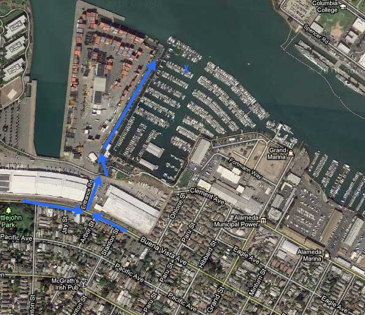

Details for the passengers and crew of Adam's boat for the tieup BBQ on
the 7th.

**Time:**

Times are a changin'. I'm waiting to hear from the other boat to set a
final time. As soon as they email me, I'll update you guys. And I'm
still asking around, so there may be more boats too.

Current time: Meet at 10:30am, and try to leave around 11.

**Directions:**

Fortman Marina 1535 Buena Vista Rd, Alameda, Slip \#C26

The marina isn't quite on Buena Vista. Take Buena Vista to Entrance Rd
(which looks like a big driveway). From Entrance Road, you'll see a sign
for "Alameda Yacht Club" and "Fortman Marina". Enter there, drive
\_past\_ the yacht club, and 1/3 of a mile all of the way to the back of
the parking lot. Then call me, and I'll open the gate for you.
(510-512-4398)

**What to bring/not bring:**

-   Dress in layers. Duh, but it has to be said.

-   Don't wear heels (private joke)

-   The boat stays pretty dry, but I will have a kayak you can use, so
    you might want to bring a change of clothes which you can get wet,
    and then change out of.

-   I have life jackets.

-   I have motion sickness pill if anyone needs them.

-   I'm getting Aidell's Habenero sausages and buns. Please bring more
    food.

-   I'm stocked up on Sierra Nevada, and have a fairly full bar. But if
    you have any special requests email me and I'll let you know if I
    have it.

-   I have a bbq and a brand-new stove. (No oven, and the microwave
    needs shore power.)

