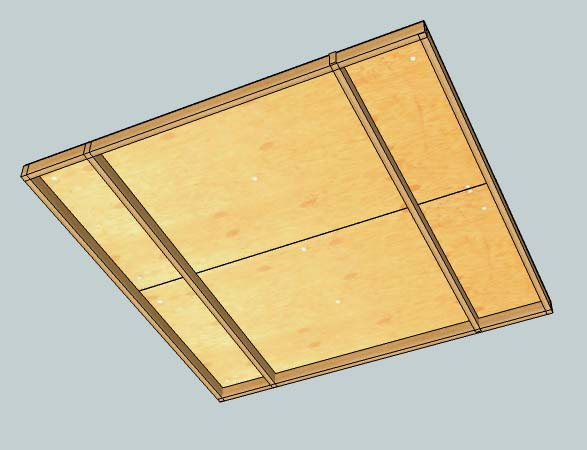
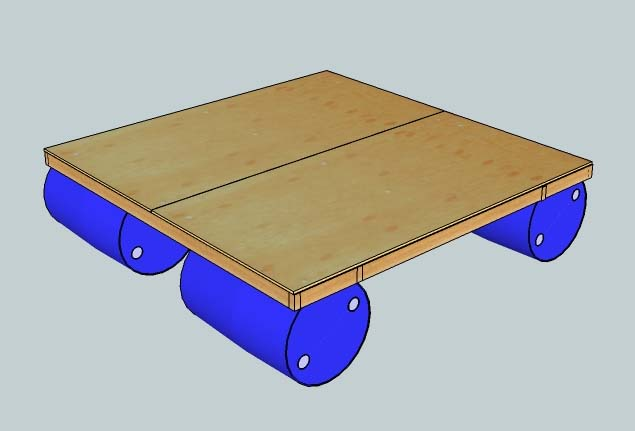
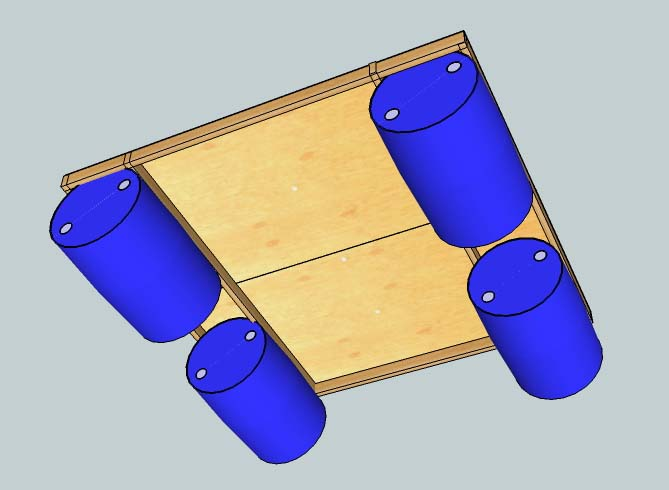

Design Goal
===========

Create a easy to build, affordable, BYOL for 1-2 people.

Result
======

The frame seemed rock solid. The platform was designed for 2 people to
sleep on it. Shortly after it was floating, 4 people were literally
jumping up and down on it, and it held together just fine.

Two of the 4 barrels ended up leaking. Barrels have been used with
success before. So, the moral of the story there seems to be to seal
your barrels before departure and test them!

Putting the barrels in a simple track also worked great. After removing,
and fixing, one leaking barrel it was put back without any rope and it
held there for the rest of the weekend.

Overall, the design seemed to be a solid success: affordable and easy to
build.

Parts List
==========

-   2 x 19/32 4x8' plywood
-   6 x 2x4 (2 @ full size, 4 cut down by 3.5")
-   2.5" screws
-   4 55 gallon drums
-   Rope
-   Silicone Caulk

Tools
=====

-   Saw - A handsaw should be fine as very few cuts are necessary.
    Better yet, have Home Depot make those cuts for you. But if things
    don't fit, you might have to make adjustments.
-   Power drill/driver/screwdriver
-   Chalk line - Not required, but it helps line up plywood screws
-   Chaulking gun
-   Pipe clamp

Construction
============

<b>Barrels</b>

1.  Seal the edges of the barrels with caulk
2.  Carefully, yet forcefully, put on the lids ensuring that the threads
    are lined up and it goes on straight. (This is tricky!
3.  Use the pipe clamp to really tighten the lid down all of the way.
4.  Let the caulk set.
5.  Float it and make sure it doesn't leak.

<b>Frame</b>

1.  Lay everything out, upside-down, to make sure that the joints fit
    correctly and the cross beams are tightly pressed against the
    barrels.
2.  Screw the frame together (from the side) with 2 screws holding
    together each joint.
3.  Move the barrels off to the side
4.  Move the plywood on top of the frame
5.  Screw the outer edges of plywood into the frame.
6.  Use the chalkline or a tapemeasure and pen to make the top of the
    plywood with the location of the cross beams.
7.  Screw the plywood into the cross beams.
8.  Screw holes into the side of the frame, adjacent to the barrels with
    matching holes in the cross beams. One hole need to be inline with
    the ridge near the top of the barrel. The other should be in the
    center of the barrel.
9.  Lash the barrels on to the frame.
10. Float it!

Modifications
=============

1.  Adding another crossbeam (this one horizontal) across the seam would
    provide additional rigidity. Not necessary, unless the frame is
    expecting heavy abuse.
2.  Using 27 gallon bins. (See notes elsewhere for how to seal them).
    The crossbeams should be adjusted so that the bins fit properly. 4
    bins may not provide enough floatation to guarantee the top of the
    platform stays dry (880lbs of floatation vs 1760 for the drums), but
    6 bins (3 in each track) should be sufficient.

