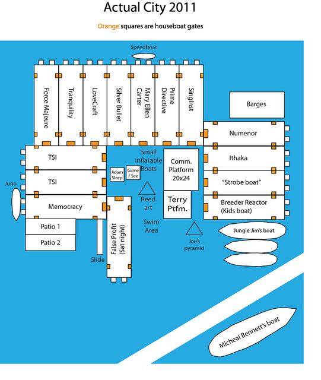

Ephemerisle 2011
================

 Ephemerisle 2011 took place during Jun
9-12, in the same location as the previous two years - the Mandeville
Tip County Park on the [Sacramento – San Joaquin River
Delta](wikipedia:sacramento_–_san_joaquin_river_delta.html)
([<http://maps.google.com/maps/ms?msa=0&msid=207854270338809155245.0004864803082020221ed&ll=38.058837>,-121.539345&spn=0.047915,0.098791&z=11
map]).

After having to rebrand the event "NotEphmerisle" (or "UnEphemerisle")
last year due to insurance and legal technicalities, this year [The
Seasteading Institute](http://seasteading.org) did not officially
attempt to organize the event and let us use the name "Ephemerisle". We
rented out every houseboat in the region, built a 20x24 [floating
platform](community-platform.html), brought around 200 people, and made
the event an unequivocal success.

Read **Matt Bell's excellent [summary of Ephemerisle
2011](http://nasu-dengaku.livejournal.com/372390.html)**. Paul Bohm also
write his [thoughts on what made Ephemerisle a great occasion to
connect](http://paulbohm.com/ephemerisle-2011-summary/).

Photos and videos
-----------------

-   [30-second 360-degree video of Ephemerisle
    City](http://www.youtube.com/watch?v=3TvWO7BvQ8E) and
    [panoramas](http://www.facebook.com/media/set/?set=a.10150208041372800.328266.606977799)
-   [Matt Bell's Flickr
    set](http://www.flickr.com/photos/9055206@N06/sets/72157626598333575/)
    and
    [video](http://www.flickr.com/photos/9055206@N06/5832033024/in/set-72157626598333575/)
-   [Flickr pictures tagged
    ephemerisle2011](http://www.flickr.com/photos/tags/ephemerisle2011/)
-   [Darryl Hunt's Picasa
    album](https://picasaweb.google.com/arcanepackrat/Ephemerisle2011)
-   [Tanya's Picasa
    album](https://picasaweb.google.com/memgineer/201106Ephemerisle)
-   [Bonnie's Flickr
    set](http://www.flickr.com/photos/53978179@N06/sets/72157626977117302/)
-   [Testing Matt Bell's game
    platform](http://www.youtube.com/watch?v=TXl0nMoD1nY)
-   [Ping's pictures on
    Facebook](http://www.facebook.com/media/set/?set=a.10100483831200203.2884160.1219300)
-   [Scott's pictures on
    Shutterfly](http://share.shutterfly.com/share/received/album.sfly?startIndex=0&sid=0AYuWjVw4YsmjiA&fid=9d1553f38df7a19d)
-   [Cj Sewell's pictures on
    Picasa](https://picasaweb.google.com/Poorfinn/Emphermerisle2011)

Technical details
-----------------

-   [Community Platform](community-platform.html) (aka "center stage") -
    a 20x24ft. floating platform assembled on location
-   [BYOL design](byol_design.html) (Bring Your Own Land)
-   Research on how to [float](floatation.html) structures

Talks and lectures
------------------

-   (Most of the) [Ephemerisle 2011
    microtalks](ephemerisle-2011-microtalks.html)

Ongoing discussions
-------------------

-   [What worked and what didn't in 2011](what-worked.html).
-   [Ideas for 2012](ideas-for-2012.html) (what would you like to try
    next year?)

Lost and found
--------------

-   [Lost and found
    spreadsheet](https://spreadsheets0.google.com/spreadsheet/ccc?authkey=CNX31LYG&pli=1&hl=en_US&key=t5er2-xbSpCnuQHVP9_iDBg&hl=en_US&authkey=CNX31LYG#gid=0)

