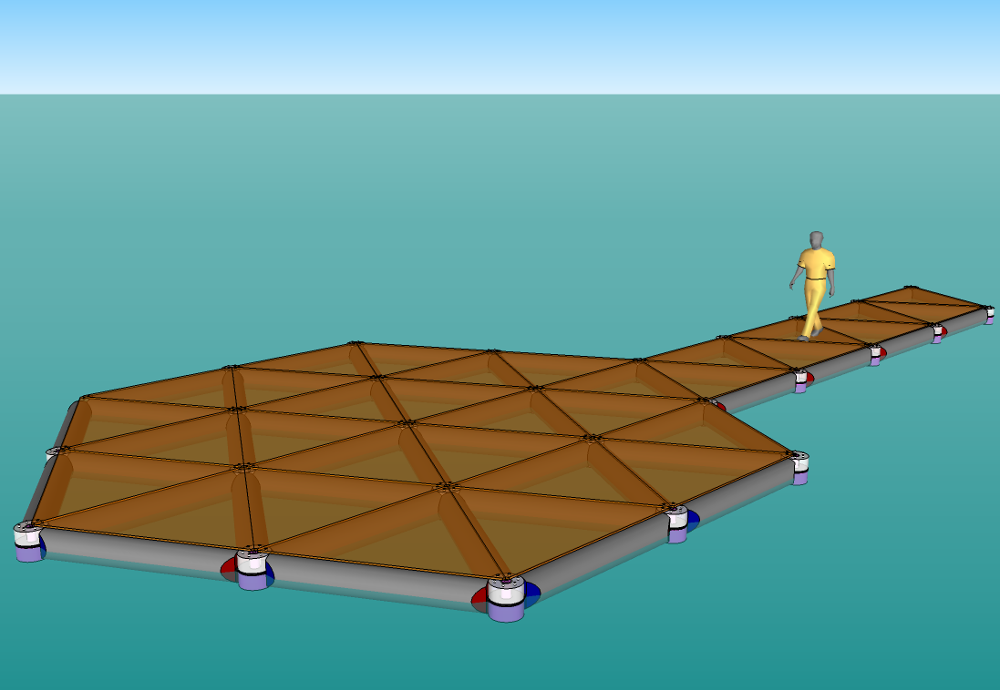
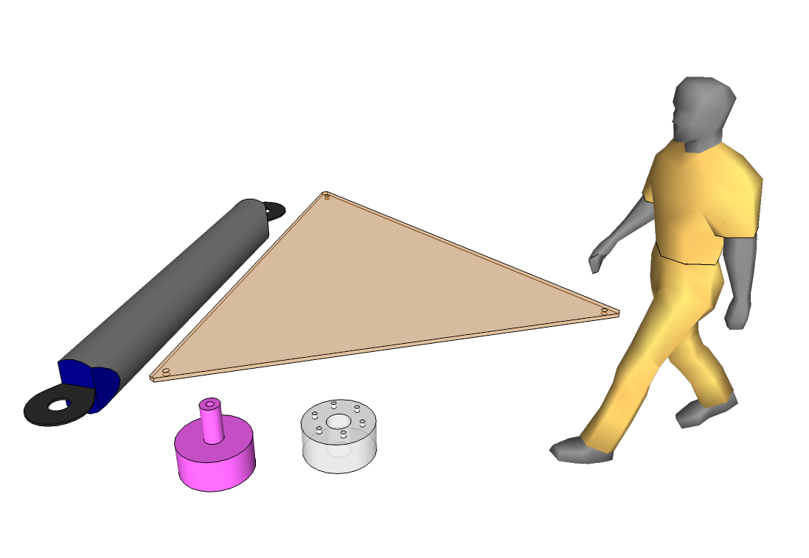
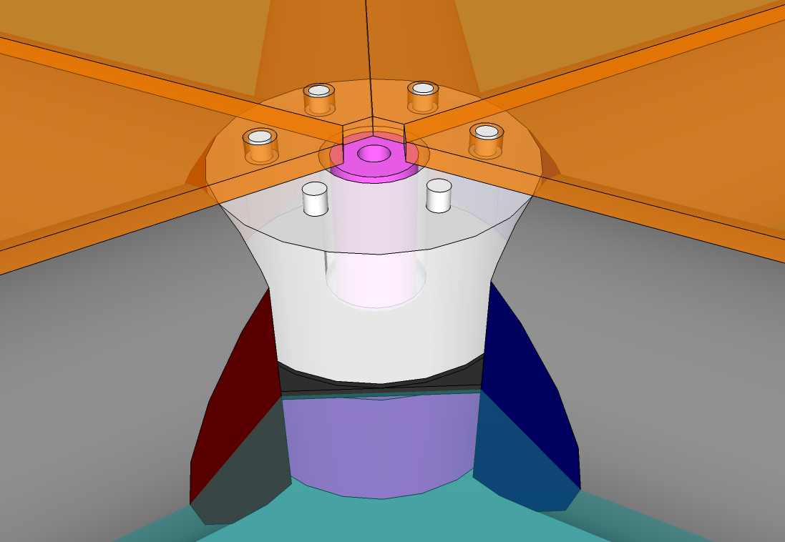
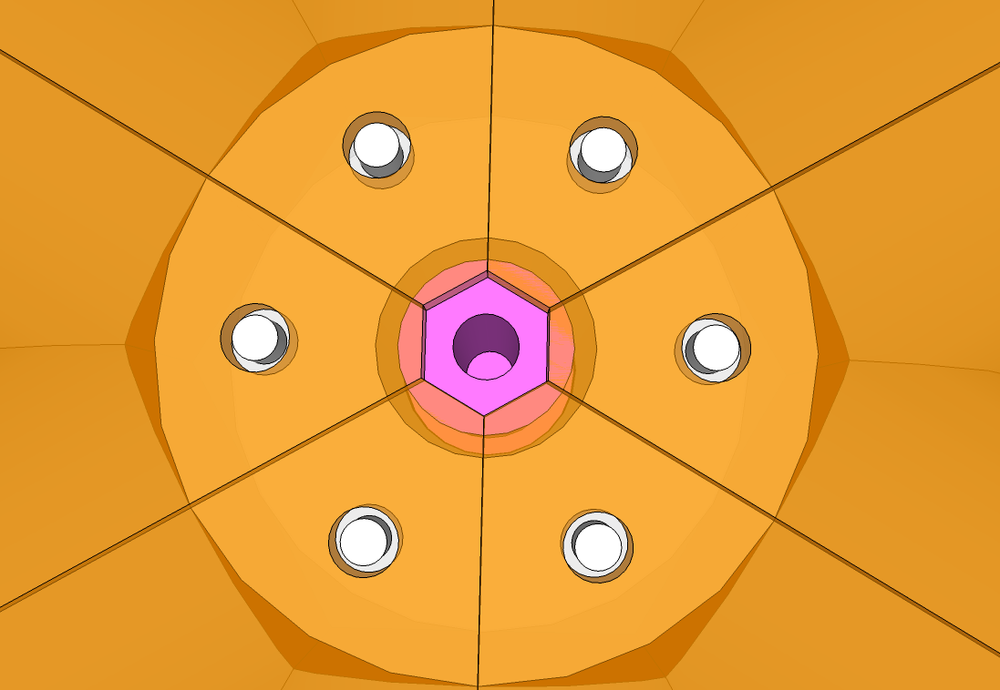

Hexyfloat
=========

up sides
--------

-   light weight
-   easy to assemble
-   reconfigurable
-   super fun

down sides
----------

-   complex to manufacture
-   possibly expensive/unstable/unreliable

components
----------

-   inflatable tube with integrated tabs
-   top cap
-   bottom cap
-   triangular slab
-   (soul-less man not included)

design ideas
------------

-   [Island Hopper 25' ft floating
    trampoline](http://www.watertrampolinesoutlet.com/ZenCart/index.php?main_page=product_info&cPath=65&products_id=182)
-   [Modular rectangular floating trampoline in
    Vienna](http://www.somersault.co.at/gewerbanlageneng.htm)
-   [catamaran trampolines](http://www.multihullnets.com/)

