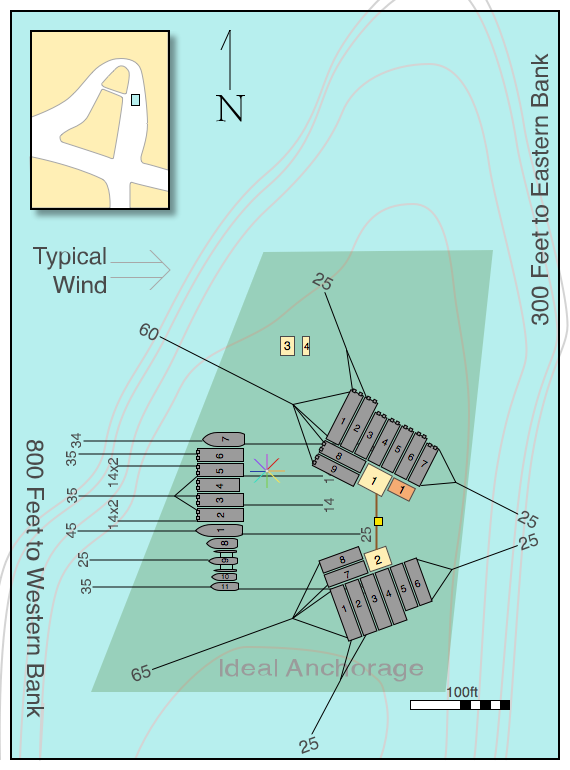

Ideas for 2012
==============

Add agenda items for the planning meeting here [Ephem2012 Planning
Meeting Feb 25](ephem2012-planning-meeting-feb-25.html) LA Planning
Meeting Notes: [CRASHSpace Ephem2012 Planning Meeting March
7](crashspace-ephem2012-planning-meeting-march-7.html) LA Planning
Meeting Notes: [CRASHSpace Ephem2012 Planning Meeting May
25](crashspace-ephem2012-planning-meeting-may-25.html)

General
-------

1.  Mike suggested that people willing to help with boat operations
    could wear his awesome custom bow ties.
2.  an area meetup or marina meetup would help to review basics: assume
    that 70% of participants are new to boating/NE.
3.  Sunscreen Massage Tent
    :   3-5 people at a massage table. Rotate giving and getting a
        massage. Use sunscreen as the massage oil. A great way to start
        your day. (Credits go to the early 90s burningman Sunscreen
        Massage Camp)

4.  Better location for non-houseboats
    :   Houseboats became the core of the city, with any other craft
        (sailboats, speedboat, the barge) being relegated to the
        boonies. Since these craft possibly better represent our future,
        next year they should be incorporated into the center of the
        city.

5.  Lighted buoys on the anchor lines to prevent boat incidents at
    night, Gang planks, Rope ladders/bridges, More land - tpot
6.  Reconfigurable [common space](hexyfloat.html).
7.  A floating hot tub. (Talk to Brian Hill)
8.  How about a bowling lane? It is possible to rent them, and we could
    set it on top of some houseboats.
9.  An absinthe club ("La Belle Ephemera") is being established. Contact
    Captain Kurt (thipdar ta gmail tod com) for details.

Scheduling
----------

1.  Monthly events throughout the year to help keep up momentum, and to
    cover some of the other things listed here.
2.  Soft start the weekend before... people arriving early for more fun,
    earlier start to the city
3.  Microtalks sooner in the event, so we can meet people we're
    interested in, and talk about the subjects in more detail... say,
    Friday.
4.  A couple of tracks in addition to the Memocrazy microtalks: Kidzone
    for kid activities (as per below), and Seamanship, for those wanting
    to pick up some skills on the water. Would it be worthwhile to reach
    out to the Sea Scouts?
5.  Pre-event coordination between the various parties that would use
    the radio facility: The Radio FMerisle calendar is available for
    viewing
    [here](https://www.google.com/calendar/embed?src=qbo98ulkn27sf31tnnevqlutto%40group.calendar.google.com&ctz=America/Los_Angeles)
    and it includes the broadcast schedule. The broadcast schedule will
    try to accomodate everyone, as needed, and will probably play music
    in the background when nothing more important is going on. We will
    need to have DJs sign up to work in the studio, and we will need to
    schedule performers and speakers; if this can be done ahead of time,
    so much the better (not that the speakers or performers need to be
    named, but the time slots should be allocated ahead of time). If you
    want to sign up for a time slot, send your request to thipdar ta
    gmail tod com and make the subject line "Broadcast Schedule
    Request". Time slots will mostly be allocated on a
    first-come-first-served basis, but there may be some negotiations
    about some of the times.

Communication
-------------

1.  An open list of key people (including faces) possessing specialized
    knowledge. There were so many new faces, and a lot of not knowing
    who to ask for help. The existing strategy is good for meeting
    people, but less good for getting stuff done.
2.  local FM transmitter, for micro-talks and bad music. (Thipdar: A
    houseboat has been reserved for Radio FMerisle, Dave W. will
    probably be the radio engineer and general manager)(Well, it looks
    like we can operate licensed after all - another application appears
    to be more successful. Call sign WF9XRS has been issued for a 10-mW
    transmission on 95.3 MHz, and it's still showing as "granted" a week
    later on the FCC website... -dw)
3.  WIFI if anyone feels it necessary. Is there sufficient local content
    to warrant this?
    :   Internet! +5

4.  Request to all boat captains: Please write up a description of your
    boat's focus, what's going to be of particular interest or any
    special event(s) that you want to share, etc., and pass it along to
    Radio FMerisle for boat-oriented on-air announcements.
5.  Request to others: Anyone that has a valid Public Service
    Announcement (such as where the First Aid Station is located, etc.),
    please write that up and pass it along to Radio FMerisle, for
    event-oriented on-air announcements.

Seasteading
-----------

1.  The Seasteading Institute's Director of Engineering George Petrie
    has offered to consult on a project for next year if there is a team
    interested in designing/building a small model of future seastead.
    For example, he could coach the building of a small semi-submersible
    platform such as those showcased on our website, which could be used
    a community space for future Ephemerisles. Contact Randy Hencken for
    info.

Art
---

1.  Floating fire tornado!
2.  Underwater lights ([Subshine](subshine.html),
    [Jellypus](jellypus.html))
3.  Art boats
4.  Painting the main platform and other public space.
5.  The Absinthe club ("La Belle Ephemera") will try to arrange for
    models to pose, so that members can sketch them while enjoying a
    drink.

Kid-related thoughts
--------------------

1.  would like to see kids houseboat expand to two houseboats - we met
    people who have kids but didn't bring them
2.  kids boats publish invitations (date/time) to all participants to
    play with us, with a list of resources available, such as
    snap-circuit electronics, ski boat, games such as Blockus - maybe
    have a Cup for winner of multiple games
3.  maybe a kid-oriented talk block... sign up for a few minutes to talk
    with kids about what you do for a living, how to get into nanotech,
    how to anchor, etc
4.  something to support the group that might be getting started re
    geeks with kids
5.  Hot Dog Hour - kids grill a lunch for you
6.  kids or someone offer pins or badges for accomplishments / skills -
    use a walkie-talkie, anchor a boat, pilot a boat, tie a line to a
    cleat

Transportation
--------------

1.  During the 2011 event, one of the workers at H&H marina offered boat
    rides to people who arrived later. We should make arrangements with
    him again next year. He only charged \$10.00 a head. That way the
    ski boat can be used for more fun activities. - Placeholder for his
    contact info - (Note: California Law requires a special boat
    operator's license for anyone that hauls more than two people at a
    time for a fee. I think it's awesome that he did it, but does he
    have the license to do it? And what is Ephemerisle's liability of he
    gets caught operating that way without the license?)
2.  The ski boat was in near continuous operation as a transport vessel
    throughout the event. Not many people got to use it to wakeboard or
    waterski. If we can outsource transport to one of the local boats,
    it would free up the ski boat. (Thipdar: Captain Travis will be
    bringing a speed boat, and he will definately NOT be providing GP
    shuttle services for attendees. His boat will be available for fun
    things. If you are interested, you should make arrangements by
    individual negotiation.)
3.  If we do use a ski boat/patio boat for transport, early on, we
    should set up a shift schedule, and train volunteers how to pilot
    the boats. That way, no single person gets too much pilot duty.
    Whoever provides a shuttlecraft should establish a Google Calendar
    to manage the shuttle schedule; such schedules shold be viewable by
    everyone.
4.  We should set up a regular transport schedule. Maybe a boat every
    hour during the busiest times? It can only hold 6 people at a time.
    Alternatively, use the patio boat. It's slower but can hold more
    people. (This remains under debate -- the bigger the hurdle to get
    to the event, the more interesting/determined people we might have
    there). See above - anyone that provides a shuttlecraft should
    establish a Google Calendar to manage that shuttle's schedule.

It's probably best not to depend on the patio boat too much for shuttle
service - in anything other than the smoothest conditions its speed was
limited by the tendency to flood the foredeck and bury it in the waves -
this was noticeable with even the 1-2 ft. waves we saw sometimes, or
even wakes from other boats. Also, it seemed to always make
late-afternoon runs which were over-optimistically expected to return
before dark, and it was the boat that was the least suitable for night
running, as it had no lights. Patio boats are probably better as
"self-propelled portable land" than "shuttle express" craft. -dw

Safety
------

1.  [Fr33aid](http://www.fr33aid.com/) is a group providing medically
    skilled voluntary personel to freedom-oriented events.
2.  The Seasteading Institute's First Aid Kit has been donated by Patri
    Friedman. It will be made available to anyone that is willing to
    manage a First Aid station at the event.

City Layout
-----------

-   **North - Harbormaster: Jason Levin**

1.  1.  Grand Sierra - Straumli Lab (Loud) arriving Wednesday Morning
    2.  Summit - Baysian (Loud) arriving Wednesday Afternoon
    3.  Summit - Conspiracy (Loud) arriving Wednesday Afternoon
    4.  Summit - Yacht Club (Loud) arriving Wednesday Noon
    5.  Crownship - Radio FMerisle (Medium) arriving Wednesday Morning
        (unless docking it to \#1 doesn't make more sense)
    6.  Summit - Mustache Ride (Gerry) (Medium) arriving Thursday
        afternoon
    7.  Crownship - StuntPeople? (Medium) - Thursday afternoon
    8.  Summit - Memocracy 1 (Medium) arriving Wednesday
    9.  Summit - Memocracy 2 (Medium) arriving Wednesday

-   **South - Harbormaster: Paul Grasshoff** (FRS channel 7, or call
    323.428.4434)

1.  1.  Grand Sierra - Family Planning (Quiet) arriving Wednesday
    2.  Grand Sierra - Big Boat (Medium) arriving Wednesday Noon
    3.  Grand Sierra - Welcome Wagon (Medium) arriving Wednesday 1 p.m.
    4.  Grand Sierra - Snuggly Nemo (Quiet) arriving Thursday Afternoon
    5.  Crownship - Chaos Legion (Quiet) arriving Thursday afternoon
    6.  Crownship - Misc Heathens? (Medium) - Thursday afternoon
    7.  Summit - Equanimity Tea House (Quiet) arriving Wednesday 1 p.m.
    8.  Summit - Borealis (Medium) arriving Wednesday morning

-   **West - Harbormaster: Paul Wheeler (Hail "Serenity" on VHF 69, or
    call 206-669-6428)**

1.  1.  Serenity (Medium) arriving Wednesday Morning
    2.  3.  -   -   somewhere in west?\*\* Meneltarma - 43x23 powered
                catamaran arr Wed 4pm

    4.  Crownship - Red Boat (Medium) arriving Wednesday Morning
    5.  Summit - Jellypus (Loud) arriving Wednesday Noon
    6.  Summit - The BattleStarr (Loud) arriving Wednesday morning
    7.  Strange Behavior (Loud) arriving Wednesday
    8.  Temptress
    9.  Solara
    10. Couch
    11. Adam Katz

-   **Platforms (Pictured in Yellow)**

1.  1.  Central
    2.  Cuddle
    3.  La Belle Ephemera will attach to the aft of Radio FMerisle until
        Saturday afternoon. On Saturday afternoon, it will need to be
        moved to the middle area of the layout in order to become the
        Performers' Platform.
    4.  Hypothetically Sinking (Medium, where is this attaching?)
    5.  Lemonade and Lasers (8'x8' - Will be as a rope barge / ferry
        between north and south platforms)

-   **Mobile Vessels (Pictured in Orange)**

1.  1.  Patio Boat

**Notes**

-   The Houseboat rafts will have a large number of additional 14lb
    Danforths w/ 100ft scope out that are not pictured. A balance needs
    to be found. More anchors is more holding power. But there is more
    risk of boat props getting tangled in lines and of anchor lines
    getting twisted. It also means a lot longer to dismantle the city.
    Even 14lb anchors can be difficult and slow to pull out after
    they've been digging into the mud for a week.
-   Platforms & vessels \< 20 ft are not pictured, I figure we can just
    stick them wherever

Layout Discussion
-----------------

Options Discussed:

-   **One big long raft**
    -   *Pros*
        -   Easy to anchor properly, not likely to drag
        -   Fast/Easy to set up and take down
        -   If we drag, at least we won't have on raft crashing into
            another
    -   *Cons*
        -   Lack of city center
        -   Takes forever to get from on end to the other
-   **Two big rafts, one behind the other**
    -   *Pros*
        -   We sort of have a center swimming/platform area
        -   Similarly easy to anchor as above
    -   *Cons*
        -   Either the gap between the two rafts needs to be quite
            large, or we run the risk of fouling anchors
        -   Risk of the windward raft drifting into the leeward
-   **One big U shaped raft**
    -   *Pros*
        -   Ideal, sheltered, city center
        -   No ferries necessary
    -   *Cons*
        -   Difficult to set up & take down (people cannot easily be
            added/removed from the middle)
        -   There isn't really a good place to put the sail/power boats
        -   Difficult to anchor properly: You've got 26+ large boats all
            lashed together, thats probably over 400,000 lbs of boat.
            All of those boats are going to be pulling in one direction
            *most of the time.* So, you have to put out a ton of big
            sturdy anchors in the direction of the dominant force, the
            west wind, and since only \~40% of your boats face that
            direction, they have to take the load of the other 60%. But
            if the wind changes. you really don't want this barge to
            swing because that would turn all those anchors you put out
            into a tangled mess. So you have to put out stern and side
            anchors, and these need to be similarly beefy to be safe.
            Even with those anchors out to the side, if you do end up
            hanging on those anchors you're putting a lot of stress on
            the leeward corner, because the leeward boats don't have an
            anchors holding them and are just torquing on their
            connection point to the other boats.
-   **Three rafts, one up wind w/ sail/power boats two downwind with
    houseboats**
    -   *Pros*
        -   The anchoring for each raft, independently is easier &
            safer, since the total mass of each raft is 1/3 of the
            whole. You have less risk of extreme stresses in one
            direction
        -   There will still be a "center" even if its not as
            tight/enclosed as with the big U
        -   There's plenty of space & attachment points for vessels
            coming and going, and for recreation/swimming
        -   In the event that the wind shifts, the most likely dragging
            scenario is that the leeward raft drags away from the rest
            of the group, the windward raft will always be very well
            secured regardless of wind direction
    -   *Cons*
        -   The need for barges and ferries.
        -   The city is more spread out
        -   Difficult to control position and anchor well
        -   Slightly less wind blockage/protection for the
            platform/recreation spaces.
-   **One U-shaped raft for Houseboats downwind, one long raft for
    sailboats upwind**
    -   *Pros*
    -   *Cons*
-   **A circle of houseboats (like the Christians do)**
    -   *Pros*
        -   Stylish
        -   Half of the boats are exposed from any angle, so if done
            right boats will only be taking 2x the load they were
            designed for.
    -   *Cons*
        -   Non-houseboats are pretty much excluded from such a design
            since they don't stack well.
        -   It would take careful planning or all boats would have to
            show up at the same time.
        -   The nice walkways provided by a line of houseboats would
            disappear making it much more difficult to get around.

-   **One big group tied to the posts on the shore of Mandeville Tip**
    -   *Pros*
        -   Not as challenging.
        -   Very secure anchor points to the west of the boats.
        -   Not as hard to shuffle boats around if we need to. Somewhat
            easier for boats to come and go.
        -   Keeps the community together.
    -   *Cons*
        -   Not as challenging.
        -   Having the flotilla tied to shore dramatically changes the
            feel of a water based event.

