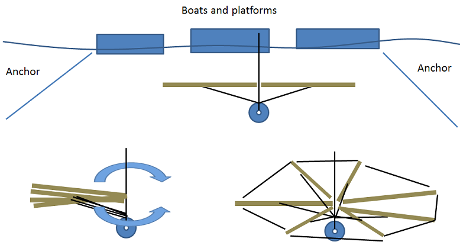

Hi, this is Cyprien. I am thinking of building an underwater lighting
system. I am not looking to solve the LEDs or programmability part for
now, but I am talking to Clive to see if we could work together on that.
I want to focus on how to deploy a large frame under the boats without
contact with the surface, or having dangling ropes everywhere. I came up
with this, I would be happy to get feedback.

The project could be made of pvc or wood sticks, maybe 10 or 20 feet,
and ropes. The sticks carry the LEDs, and would be slightly buoyant, but
attached from underneath to a weight, so that they remain horizontal at
let’s say 4 or 5 feet under water.

It would be assembled and transported with all sticks folded together.
Then on site, the weight would be attached to the stick and the whole
thing would be lowered in the water from the side of a boat or platform.
Then ropes could be pulled on each side to spread the sticks like a fan
under the boats.

The end result should look like some kind of giant octopus sitting under
the city, glowing like a jellyfish: the Jellypus!

