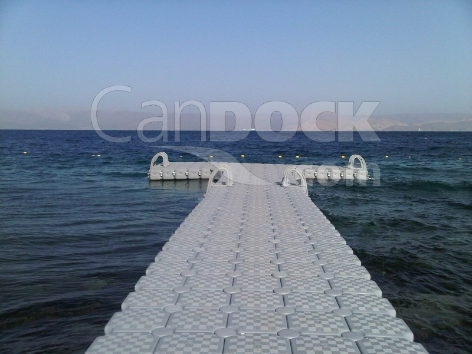

The Vision
==========

I have a vision of replacing the 4x8 plywood and bin platforms with a
modular, distributed, scalable alternative. I feel this is, in a very
fundamental way, inline with the decentralized notion of ephemerisle,
and important to the long term growth of the event.

The Plywood Pain Points
-----------------------

The 4x8 plywood and plastic bin technique though cheap and effective,
comes with a number of downsides:

-   platform construction and tear down is time consuming
-   hauling the 4x8 plywood is a pain, especially at the end of the
    weekend
-   the massive pile of plywood needs to be stored through-out the year
-   the platforms tend to sink a bit during the weekend
-   the plywood damages the boats during transport

Though working together as a community is fun and frankly an integral
part of the event, the amount of labor that goes into this style of
platform is high. There is an aspect of this labor which I think is
hidden to many: at the end of the weekend people hall a few boards off
their boat, then head home exhausted from a weekend of awesome. The few
remaining folks have to load the plywood and bins into a truck, and
drive it to storage and unload. This tends to be a small, soft spoken
set of rock stars, who are also wiped out from the event. This is tough
on those folks but also represents a centralized pain point that simply
will not scale up with the event.

The Alternative
---------------

Consider instead a commercial product like
[Candock](http://candock.com/). These platforms are constructed from a
number of cubes, each of which is light, durable and very, very buoyant.
They are fairly expensive, but come with some real advantages.

Distributed
-----------

Though we would likely buy cubes in batches, ownership would be
distributed among the community such that one person would own one or
just a few. One cube is small and easy to store. A cube fits in a normal
car, no need to rent a truck, ever! They are light and easy to cary,
nobody is going to wreck their back carrying around a cube.

One other upside here is that cubes would naturally distribute to
islands, a large island can create a larger platform, etc.

Scalable
--------

As the event grows, so will our platform needs. If we hit say 5 or 10%
cube ownership in the community then our platform area will simply scale
with the head count. When cube ownership percentage get's too low, we
buy more cubes. The cubes are durable enough to last for many years of
use, and could also be a part of ephemerisle spinoff events like the
Clipper cove tie up. Imagine a dance platform at Clipper Cove! :)

Modular
-------

The cubes can be easily configured into whatever form we need at the
moment. We could temporarily bolt several small platforms into a large
central dance platform for one evening. We could create walkways between
islands. They are even sturdy enough to be used as a barge. The time and
energy to reconfigure is low.

Bootstrap
---------

Modular docks is not a new idea to ephemerisle, however past research
has led to concerns around cost and availability. To help boot strap
this process I went ahead and bought 6 cubes. It was fairly fast an
easy. We will get to play with them on the river this year and see how
they actually perform. I predict that the per-cube cost will be about
\$100 when we buy in quantity. Some of us may not be able to afford that
kind of cost, but frankly many of us can, and amortized across a few
years this starts to look like a better and better deal.

I would love to see cubes become common place at our annual coalescence
of great people.
