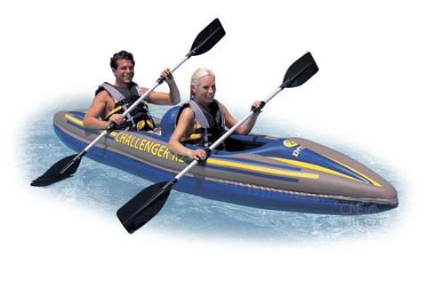
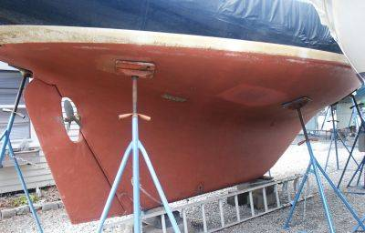

Ships operate in two mediums - air and water.

Pushing through water (water resistance) is much more difficult than
pushing through air (wind resistance).

Thus, if there was zero wind, you'd want a boat which was as light as
possible, as high out of the water as possible, and only pushing through
the minimal amount of water.

But, when there is wind and current and other factors boat design
becomes much more complex.

The basic \$20-100 inflatable boat has a flat bottom. In terms of water
resistance, it is only a bit easier to push these boats forward than it
is to push them sideways. And in terms of wind resistance, they are
built such that they catch the wind from the side. If these boats are
ever out in a crosswind, then it is going to be almost completely up to
the paddlers (no help from the boat) to fight that wind and keep heading
towards the intended destination.

Note - these inflatables actually did a every good job on the rope
bridge. They're light so they glide across the water, and clipping a
carabiner onto the rope was enough to counter the effects of the wind.
The boat would point directly into the wind, but then glide easily
sideways across the water.

 

As for Kayaks, the better kayaks are going to be low set such that they
don't catch much of the wind, but cut down into the water a bit such
that they "track" correctly in a bit of a wind or current. The cheaper
kayaks are going to have more "windage" and not cut down into the water,
such that they kayaker will just get pulled down wind.

Note - the design principles for white water rafting kayaks, and what
makes a good white water rafting kayaks may be completely different than
for what makes a good kayak for getting from point A-B with wind and
currents.

The vast majority of row and powerboats are built with something of a
v-shaped hull. Even expensive inflatables have a hard or inflatable
v-shaped bottom. This design means that when wind pushes these boats
from the side, the force of the wind will be countered by lots of water
resistance. But when the boat is being pushed forward, the boat cuts
through the water and moves forward easily.

Sailboats take this to a much bigger extreme, where it isn't just the
force of wind on the side of the boat but the wind on the entirety of
the sail which has to be countered by water resistance. That's why
sailboat have big keels. Without these keels, sailboats would just
travel almost completely sideways making almost zero forward progress.

I hope that helps people understand a bit of the physics of why cheap
inflatables are a bad idea on a windy day, and maybe also help people a
bit in future DIY boat design.

(Disclaimer: The author is anything but an expert on these matters)
