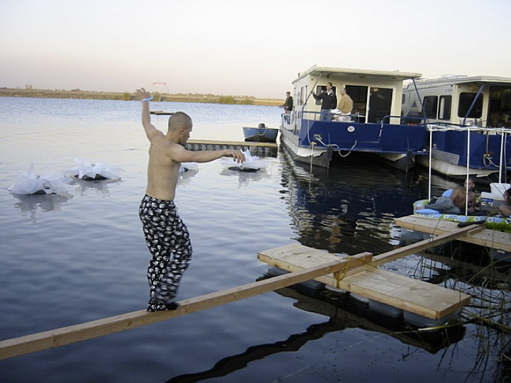

*Note: large parts of this guide are adapted or taken directly from the
original Ephemerisle survival guide. This event however is in no way
connected or official endorsed by TSI.*

Safety and Survival
===================

Participants who attend Ephemerisle will have to bring all personal
necessities to the event: food, shelter, water, fuel, necessary
medications, and basic first aid supplies. Please keep in mind that you
are responsible for yourself at all times, in every regard, as you
approach, once you enter, and as you leave the Ephemerisle site.

Above and beyond the provision for individual survival, everyone is
requested to help ensure our collective survival by following very basic
rules relating to public safety and community well being. We ask you to
please abide by these standards.

**If you read nothing else please read these 4
points:**

Radical Self-Reliance
---------------------

YOU are responsible for getting yourself to and away from the event site
and for everything you'll need to live there and survive for your stay.
There are few to no resources adjacent to the event site, and none on
the water. Think carefully about what you'll need, and plan ahead!

Safety
------

Never forget that you're living on the water, which requires a higher
degree than usual of personal vigilance. If your step is already
unsteady, walking on an unstable floating surface will make balance more
challenging. Wakes from passing craft add another level of complexity,
as does the movement of close-moored vessels against one another.

### Intoxication

Being inebriated at the event is highly discouraged. If you are under
the influence and cannot take care of yourself, you are not capable of
being radically self-reliant or safe which poses a threat to yourself
and others. There are no dedicated medic boats, and getting emergency
help in a timely manner is a very difficult task. This isn't like
Burning Man where people overdosing can simply lie down on the playa;
it's a dangerous place full of drowning and crushing hazards. Also, if
you are overly inebriated, we will make fun of you mercilessly and write
on your forehead with a permanent marker. :-)

A few recommendations:

​1. Watch your intake. Don't push your limits on what you can handle. If
others are asking you if you're ok, take that as a moment to assess your
objectivity. Corollary: If you've never taken a substance (or mixed
substances) before, Ephemerisle is \*so\* not the place to pop that
cherry.

​2. If you become intoxicated and need help, ask others and stay put.
Going from area to area under the influence is not recommended. If you
do need to transport yourself, wear a life vest.

​3. If you run into someone who you are concerned about ask them about
their state, in addition, recommend that they put a life vest on.

### Drowning

So if a person falls overboard and everything looks OK – don’t be too
sure. Sometimes the most [common
indication](http://mariovittone.com/2010/05/154/) that someone is
drowning is that they don’t look like they’re drowning. They may just
look like they are treading water and looking up at the deck. One way to
be sure? Ask them, “Are you alright?” If they can answer at all – they
probably are. If they return a blank stare, you may have less than 30
seconds to get to them. And parents – children playing in the water make
noise. When they get quiet, you get to them and find out why.

Boating Regulations
-------------------

As long as we're on the public waterways, we're required to follow all
federal, state and local regulations. Know the [ABCs of California
Boating Law](http://www.dbw.ca.gov/Pubs/abc/), and abide by them. Every
person must have a Personal Flotation Device (PFD) though they do not
have to wear it at all times; all children under 12 must be WEARING a
PFD unless in an enclosed cabin. All vessels must be legally registered
unless they're only human-propelled. If you're going to operate a vessel
as part of your participation in Ephemerisle, learn about the relevant
operational laws and water-based "rules of the road". If you are
sleeping on a platform, make sure you bring a life vest; they're super
cheap and there's no excuse for not having one around. If you are
renting a houseboat, the marina will probably walk you through what you
need to know.

Leave No Trace
--------------

The Federal Refuse Act prohibits discharging or depositing any refuse
matter of any kind into United States waters. Refuse includes: garbage,
trash, oil, and other liquid pollutants. This rule includes human waste.
Note that concern about violation of these regulations creates probable
cause for a state or local peace officer or Coast Guard representative
to board your vessel. You will need to make plans to minimize and
control your waste to ensure it doesn't blow or fall into the water.

Event Basics
============

Getting there
-------------

The event
([<http://maps.google.com/maps/ms?ie=UTF8&hl=en&msa=0&ll=38.052957>,-121.538486&spn=0.071912,0.139561&msid=100718037888704317369.0004864803082020221ed&source=embed
map]) is 3 miles by water from H&H Marina
([<http://maps.google.com/maps?f=q&source=s_q&hl=en&geocode>=&q=Bethel+Island,+CA&aq=0&sll=37.0625,-95.677068&sspn=35.90509,46.054687&ie=UTF8&hq=&hnear=Bethel+Island,+Contra+Costa,+California&ll=38.061025,-121.499627&spn=0.002179,0.002811&t=h&z=18
map]) at the end of 8 Mile Rd near Stockton.

It may be possible to cross to 200 feet from H&M marina to Venice
Island, portage your craft 2 miles to the other side of the island, and
then cross another couple of hundred feet to the festival. Check before
doing this and see if the entire island is private property.

With a very shallow draft boat, it should be possible to make the 8 mile
trek from Bethel Island. But be warned, and check the charts, because
Franks Tract is only a foot or two deep in places.

What to bring?
--------------

Listed in this
[spreadsheet](https://docs.google.com/spreadsheet/ccc?key=0ArM4SmspDEEAdFc3U2E2R2s0U2M1Q1lBQm9Fc0lXZ2c).

Bathrooms
---------

House boats provide the primary supply of bathrooms. If you're not
staying on a house boat, plan on introducing yourself to your house boat
neighbors to arrange access. In 2011 several house boats reached the
capacity of their sewage holding tanks on the last day. For 2012 we're
planning on having the [Septic
Brothers](http://www.septicbrothers.com/services.htm) (209-329-0768)
pump out service visit once during the event.

House Boats
-----------

House boats make self-reliance a helluva lot easier, providing
bathrooms, showers, power, and kitchens well stocked with cooking
utensils.

Safety Details
==============

Maritime Safety – Boating Rules
-------------------------------

The California Department of Boating and Waterways has published a free
booklet titled "ABCs of the California Boating Law" that we encourage
all participants to obtain and review. Delta waterways are crowded in
the summer, and anyone operating a vessel should be familiar with the
"inland rules of the road", rules about navigation aids (what different
buoys mean), rules for boating in congested areas, and rules for
registration of watercraft. More information is available at
www.dbw.ca.gov or by calling 1-888-326-2822.

BUI – Don't Do It
-----------------

"Boating Under the Influence" is a huge factor in boating accidents in
the Delta, and is a major enforcement focus for the Coast Guard and San
Joaquin Country Sheriff's Office. No one is allowed to operate a vessel
while under the influence of intoxicating liquor or drugs; a blood level
as low as .05% may be used to indicate BUI. We'll have plenty of chance
to party once stationary at the event site – please WAIT to begin your
celebration until you're safely docked or anchored

Anchoring
---------

Because the Delta is a tidal area with river currents and a very loose
mud bottom, anchoring is unusually challenging in the area of the event.
If you are not an experienced Delta boater, we do not encourage you to
attempt to anchor your craft on your own. See
[Anchoring](anchoring.html) for more details.

Weather
-------

[http://forecast.weather.gov/MapClick.php?lat=38.06378854575867&lon=-121.54380798339844&site=mtr&unit=0&lg=en&FcstType=text
NOAA - 7 day forecast for Mandeville
Tip](http://forecast.weather.gov/mapclick.php?lat=38.06378854575867&lon=-121.54380798339844&site=mtr&unit=0&lg=en&fcsttype=text-noaa---7-day-forecast-for-mandeville-tip.html)

Electricity
-----------

120v electricity and the water is a dangerous combination. But if you
have to do it, make sure to get GFCI adapters for every cord which might
get near the water if the boat doesn't already have them installed.

Swimming
--------

In the heat of the Delta summer, the river provides a wonderful and
refreshing opportunity to cool off, play with water-based toys, and
enjoy our aquatic environment. But it's also true that the Ephemerisle
site will be a congested area with lots of vessels, moving water, and
visibility limited to 16-18". Water depths in this area range from 8-32'
– know where you are before you dive!

Dangerous Currents
------------------

The waters of the Delta can seem deceptively gentle, but you're in the
middle of a big flowing river that's also subject to tidal influences.
Boats not properly secured will drift and become hazards. Anything that
goes into the water will end up in a different place than it started.
Respect your environment at all times!

Use of PFDs
-----------

All vessels and platforms are required to contain a life jacket -- aka
personal flotation device (or PFD) -- for each passenger, as well as one
throwable rescue float. Children under age 12 must WEAR the PFD at all
times when not in an enclosed cabin. If you're planning to camp on
someone else's craft, be sure to ensure that they have a PFD for you –
or bring your own!

Radio / Cell Phone
------------------

It is a good idea for all participants to keep a marine radio or a cell
phone (in a sealed ziplock) on them with the phone \#s of at least two
other participants in memory. If someone is dragged downstream, they may
be able to float to shore but it could be a miserable day/night with the
possibility of hypothermia before they're located.

Kids on the Water
-----------------

Ephemerisle is a particularly dangerous environment for children,
although several well-supervised children did attend in 2009, and all
had a marvelous experience. If you plan to bring your child, plan to be
highly vigilant at all times. Minors (those under 18) may only attend if
accompanied by a parent or guardian. As noted above, children under 12
must wear a PFD at all times when not in an enclosed cabin. You can find
special child-sized life jackets online.

Sleeping on Platforms or Roofs
------------------------------

For obvious reasons, sleeping on an open platform introduces an
additional element of danger. We strongly encourage anyone building a
platform to construct a safety railing around the platform perimeter.
Some platform spaces – like the roofs of houseboats and motor yacht swim
platforms – don't easily lend themselves to this solution, and so
effectively constitute "attractive nuisances": they SEEM like a very
appealing place to hang out or sleep, but can be very dangerous.
