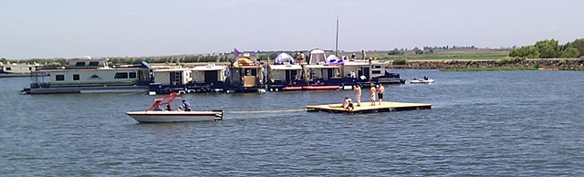

Documenting what worked and what didn't (floating bins vs barrels, taped
vs bagged, anchor line angle, etc) may be helpful for the future....

Bins vs. Barrels
================

I'll share my 2 cents here (adam). On the surface (no pun intended), it
may seem that bins were the clear winner, it may not actually be so
clear. I did a post-mortem on my platform. Two barrels worked fine. One
barrel failed because the lid was screwed on at an angle. And another
barrel failed because the lid was not screwed on tight enough. Both
failures were done because the lids were sealed, in a hurry, at the
event, when it should have happened slowly and carefully pre-event.

So I think the failure with the barrels, wasn't the barrels themselves,
but simply a failure to prepare properly and carefully seal them before
departure.

Yeah, the barrels were really variable: I think some of the lids might
have been a bit warped - some of them went straight on, and others
tended to cross-thread unless forced into alignment while being
installed. -dw

Christie: The one advantage I saw of the bins over the barrels was that
the bins provided a much more stable base. Because they were distributed
evenly across the platform, there were no points where support was
lacking and no pivot points.

There was a real problem when people tried to pass from the main
platform to Terry's platform where the barrel sections met. The barrels
caused a lot of torque between sections and nearly dumped many people
into the water when they attempted to move over to it. The bins were
much more able to absorb the change of someone stepping onto it and the
weight distributed well. I don't believe this was merely a function of
the double layer of plywood.

(After observing the problems that barrels had on our platform the first
year, I expected there to be a lot more forces tearing at the main
platform, dunking bins and potentially causing the plywood to break
apart. Yet it remained almost totally solid, with the exception of the
dipping in the middle the last night of the event. I think the
distributed support load, not only with the spread, but the flatness of
the bins, helped keep it a lot more stable.)

<b> Comments on platform structure and flotation </b>

As far as the rectangular bins went, the taped seals seemed to work well
- whatever that black fabric-based tape was, it still seemed securely
attached when we disassembled the platform. (Quickest way to unfasten it
when the time came was to slip a knife blade in the gap between the lid
and body of the bin, and cut through the tape all the way around.)

I know at one point (early Sunday?) I retrieved one of the bag-wrapped
bins that was drifting away - it was detached and partially flooded; the
taped-on ones seemed to survive 100% still attached and not flooded.

I don't think the real structural problem with the dome platform
(compared to the main platform) really reduces to "bins vs. barrels";
Adam's smaller platform (with a barrel at each corner) seemed to float
with good stability (until some of the barrels took on water at least) -
the thing about the dome platform was that each of the long sections had
floats at the ends in a narrow pattern, so each had no real "roll"
stability and was only held upright by forces at the fastening between
the separate sections: there would have been a similar problem with
rectangular bins distributed the same way.

What made the main platform work well was the structure of the plywood
deck, with the sheets overlapped and fastened to form a continuous panel
structure - this was stiff enough to distribute the load over the
floats, but flexible enough that wave action didn't create extreme local
stresses.

(-dave w)

Thipdar: The barrel-supported platform was not what I'd call a success,
except that we learned what not to do in the future. The individual 4x8
floating platforms needed better mechanical integrity at each coupling
point and the barrels are just awkward to transport and store. Even
though they were free, they turned out to be more expensive than
expected (because they imposed ancillary costs).

I'm proposing a different approach for 2012: floating triangles
supported by innertubes. The triangles would be equilateral triangles
and about four feet from edge to opposite tip. Each triangle is intended
to be a module, and any edge of a triangle should be able to be joined
to any edge of another triangle with two bolts. Proposed materials are
fir 2x4s and 'OBS' chip board. Twenty-four modules would make a hexagon
that's sixteen feet from edge to edge, suitable for the geodesic dome.
Additional modules could be used in other configurations to provide for
pathways, smaller platforms or kiyak berths, etc. I think innertubes are
really the way to go, especially if they can be purchased in bulk.

Anchoring
=========

<b> Line length </b>

I don't think anyone measured the houseboat anchor lines. But, if I was
to guess, I think that they were about 50'. This was clearly too short -
Recommended length for an anchor line is 5-7x the depth. As we began
building the city, we struggled to set anchors. After a number of
failures to get anchors to set, we started tying anchor lines together.
From this point on, anchors set easily and solidly.

<b> Have backup plans </b>

We couldn't anchor at our originally planned spot because a sailboat was
already there. And, we had to reset all of the anchors after we lost our
mooring and drifted for a while.

<b> Removing anchors </b>

Anchors should be removed by moving the boat over them and pulling up.

​1. Multiple anchor lines

With multiple anchor lines attached to one boat it may be impossible to
navigate over each anchor, if the line length is too short to allow it.
The fix was to give the anchor lines to a person in a kayak, and have
the boat remove anchors one at a time.

​2. Removing stuck anchors

Some of the anchors were very difficult to pull out. The final solution
was to cleat off the anchor and drive the boat, fairly fast, back and
forth over the anchor location.

​3. Kayak (or other small craft)

Was absolutely critical for both laying anchors and removing them. We
need to be sure that one is available throughout the event - from laying
the first anchor to removing the last one.

​4. Next year -- bring floats

Next year, we should prepare a bunch of simple floats to attach to the
anchors. Then boat can more easily depart, leaving behind their anchors
for pickup by one or two well-trained anchor removal boats.

​5. Safety

When removing anchors it's very important not to run the line over the
railing. The force on the line could easily break the railing, or send a
gate flying, leading to injury. Run the anchor line through an open
gate, or through the hole adjacent to the cleat. Also, make sure that
feet are clear of the anchor line if you're using the boat to try to pry
out a stuck anchor.

<b> Work with the wind, rather than against it </b>

It's very easy to move a boat, if it's going with the wind. It's a pain
in the ass to try to pull a boat against the wind and current. Next year
plan so that the city can be built using the wind, rather than working
against it. Specifically, work on securely anchoring a line of upwind
and up-current house boats so that the rest of the community can be
assembled with some shelter.

<b> Working with the current </b>

At the followup meeting it was mentioned that having the "open end" of
the layout pointing up-river was a good thing, avoiding problems with
children in kayaks and other small floating objects being lost
downstream. (Is this incompatible with the suggestion of the previous
paragraph about starting with "a line of [...] up-current houseboats"?)

<b>Setting Anchors</b>

Christie:

Michael observed everyone setting and removing their anchors. He had a
lot of commentary. Some of it I care to repeat. One thing that he kept
repeating that would improve anchor performance and help a lot with
getting things set (and eventually removed) was the use of Kellets.
These are weights that you attach to the anchor line to keep the anchor
in a position where it's likely to stay set. This page explains a lot of
this: <http://www.rocna.com/kb/Kellets_and_buoys>

Adam:

I don't know much about using a kellet. But the standard practice is to
have a length of chain (20') between the anchor and the line. This chain
both protects the line from cuts and abrasions, but also provides weight
to help keep it set.

I was with Mike at the start and the end. An anchor from my sailboat was
the first to go in, and with 130' of line + 20' of chain, it set
instantly and held.

For better anchoring next year, the first and most critical thing is
making sure that we have the right length of line (see the section
above). The second thing to do, in my opinion, would be adding a length
of chain to at least some of the anchor lines.

Here's an [article by Don
Casey](http://www.boatus.com/boattech/casey/34.htm)

Media vs. Privacy
=================

Please discuss...

As a courtesy, letting Ephemerislers know before being videotaped
when/if there will be cameras for media or documentaries. I heard (way)
after the fact that multiple people were upset about this, including a
couple of people in my yoga class Thursday morning. -D

IANAL, but I think capturing images (moving or still) on the water falls
under the same rules as doing so on a city street: almost no rules.
Pissing off participants would be bad and would discourage the sense of
freedom we had on the water, though. Let's hope that common sense is
used and permission requested where it is reasonable. -G

Greg, point! And also why I went with 'courtesy'. =) What's legal and
best are not always the same; mutual negotiation/agreement is usually
more optimal. We make our own policies in freedom. In any case, having a
camera on a private (owned or rented) boat would be better with
permission of, say, captain/crew, and friends who've been welcomed to
play there. -D

One of the reasons to go to Ephemerisle is to do things one wouldn't do
on a city street. Even on a city street, the arrival of a TV camera crew
tends to alter people's behaviour. I heard from several people who said
that the presence of the TV cameras made them uncomfortable or reluctant
to do things they would otherwise have enjoyed, and that's a shame. I
would love for participants to feel as free as possible to experiment,
explore, and enjoy. -Ping +1!

While the media didn't bother me personally, I agree that they were a
net-negative at the event. I also agree with Greg, and want to add that
it's a very slippery slope once we start adding rules to the event. So,
I'd like to propose two things.

​a) Members of the media should be encouraged to wear a "Press" badge
while they're in their role as a journalist. Then people will know who
the journalists are, and can hopefully be more comfortable in asking
them not to take photos. +1

​b) I'm guessing that the journalists were largely at the event because
of TSI. If this is true, as a community we should make it clear to TSI
that we largely did not like they're presence, and ask TSI to not invite
or encourage journalists to come next year.

-A

Some of my thoughts...

I understand the desire not to be photographed. I'm not particularly
photogenic, and if I were photographed doing something new, such as say,
taking a yoga class, I might well feel self-conscious. That said, I'm
not sure it's a good idea to discourage videography and photography.
It's true that some people might be embarrassed by photographs that
appear on Facebook (or in a news article). But how many people would be
unhappy that there was no visual record of something that was quite
special to them?

Taking camera gear to an event like Ephemerisle is quite expensive and
cumbersome. A good camera and lens can easily cost upwards of \$5000.00.
You have to constantly fear theft, or dropping it in the water. It's
heavy to wear, easy to bang against walls, floors, etc.

Asking for permission from every person you photograph is quite a
hassle. For example, suppose I wanted to take a photograph of a yoga
class. Do I have to get permission of everyone in the class? What if
just one person says no? Why should their preference outweigh the
preference of every other person in class?

Finally, taking photos separates you from everyone else. When you're
taking pictures, you're \_not\_ doing yoga, dancing, or playing on the
floating toys. Adding additional barriers will increase the likelihood
that good photographers will just say "Fuck it!", leave their gear at
home, and just have a good time.

I also understand some people may not want to be photographed doing
something that could get them trouble, such as taking a hit off a bong.
But if you're doing it outdoors, how practical is it to stop all
photography? After all, cameras on phones are now as good as early
digital cameras. Is that guy texting? Or surreptitiously filming the
dancing naked people? Banning the obvious cameras/media may give people
a false sense of security. When media is visibly present, at least
people know that they're likely to be filmed.

Here's the guidelines I would recommend:

-   Outside the boats, the default is that you may be
    photographed/filmed at anytime without permission.
-   Inside the boats, you must ask permission first.

That way, if you want to do something private, you can go into the boats
with less fear of being photographed.

--Chris Rasch

I like the idea of having clear policies about photo / not photo spaces
and times. For example, no recording after 9pm without permission from
everyone in the picture, and/or no recording inside houseboats w/o
permission from everyone. Requiring journalists to wear press badges
sounds great too. I think that would help balance the harm that media do
to people's self-expression with the benefit of spreading the word about
Ephemerisle to a global audience.

I suspect the small physical size / high density of Ephemerisle is part
of the problem - Burning Man has a big media presence, but it doesn't
feel as constraining to me because most of the time, there are no media
in sight. Whereas one journalist on the front deck of one houseboat can
see most of Ephemerisle. So limiting media hours (or days) could help.

`- Patri Friedman`

Hey Chris - I see your points, but I also agree with Ping that one of
the unique things about Ephemerisle is that one has the impression that
one can do things freely 'in the open' without fear of public
retribution from the 'normal'/traditional laws and rules of society.
This includes being free to do them out in open sunlight rather than
hiding away, as if it's something to be ashamed of. Even if people
aren't ashamed, taking pictures and video from this uniquely free space
and posting back in 'normal' society might in some real sense punish
those socially or even legally for trying new or unusual things.
(Especially since not everyone there was from our relatively liberal Bay
area culture.) That seems antithetical to the spirit of Ephemerisle.
People were also told it was like Burningman on the water; I've been
told by more than one photographer that one of the unofficial rules of
Burningman is that people are supposed to ask permission before
photographing others, say, nude (or at least those photos aren't
supposed to be publicly posted).

Whether or not that's true, I think a lot of this is about communicating
norms and expectations, in a space where we've specifically come to
freely create and explore our own. I was never publicly nude, so I just
went with it when she showed up earlier during yoga; but because I was
unprepared, I did more than one double-take when the camera was in my
face unexpectedly; I know in some ways it detracted from my focus,
experience, and leading of the event. (In other ways, I learned to
stretch, which is why even though I didn't 'sign up' for media at my
class, I didn't take personal issue with it.) Later, the camera was
around again, and it did make me enjoy the experience of dancing outside
less. And I liked the videographer.

Really, I think part of the upset was that a couple of people might've
been willing to be on camera if expectations/terms had just been
communicated to them; then they'd come wearing or doing what they might
feel comfortable with on video that's going out to the rest of the
world. I think it would be good to inform participants of the
possibility or probability if we're aware, and they can adjust
accordingly. Then we're giving people the opportunity to choose freely,
more fully, with more information.

I also like the idea of badges or times or announcements in advance, so
we can courteously/benevolently take 'turns' with different norms and
expectations; it's not about discouraging media, it's about finding
strategies that allow us fullest benefits of all values, including both
media and truly free play. -D

--

I agree with Ping and D directly above me.

Some other problems with outside photographers:

They are the only people there who are not participants, but rather
spectators. Makes one feel rather like a zoo animal. Especially since
the film will be broadcast to thousands of spectators on television,
many of whom will judge from an outsider's perspective. It felt as if we
were being used by the media (and TSI if they invited them).

When the camera enters a space, 10k spectators enter that space - do we
really want that?

The norm so far has been to be judicious with sharing photos with the
outside world - media photographers have other motivations and not a
social graph motivating them not to exploit.

I personally feel more violated by whoever invited the media than by the
media. I feel that our consent should have been gotten, or at least
their presence announced. I feel that hundreds of hours of planning and
work were exploited for the gain of the invitors.

Now, I do consider that the response most appropriate to the spirit of
ephemerisle would be to start a separate, no-media event on a different
weekend, or a separate camp the same weekend within kayaking distance
but outside the range of the cameras. Next year I plan to be in a boat
tethered in such a way that we do not feel guilty about detaching and
starting a separate camp if this situation happens again.

--B

--

To D, let's be clear that we're \_not\_ Burningman. And we should be
more clear about that on the wiki.

Burningman is now run by an organization which on a deep level believes
that the participants at the event cannot be trusted, and that they
cannot always be honest and open with the community. Rules and
occasional manipulation have taken the place of real communication and
cooperation. I don't want to argue that, but it is based upon
conversations with numerous leaders and employees of the BMORG.

If someday we have to go down that road, so be it. But let's delay it as
long as possible.

And B, I recognize your right to feel how you do. But I do ask that you
recognize that \_TSI started this event\_. They should get credit for
that, and we should thank them for it.

Now Patri, it's clear that a number of people were bothered by the
presence of journalists. I think that we need to ask the direct
questions and have an open conversation.

Did TSI invite the journalists?

Would TSI be willing to not invite journalists next year?

In the worst case, it looks like we might have a schism where one
flotilla allows journalists and another that forbids them. Though, maybe
that's just the nature of freedom on the water.

-A

I think the problem with the Burning Man organizer's rules is that they
are rules applied to event participants. It is an entirely different
thing to restrict outsiders / observers /audience / spectators who are
not participants in the event. Spectators are what our media members
have been so far, and is what the audience of a TV show of documentary
usually are. As far as I know, no one has had a problem with actual
participants taking photos, videos, and even 3D scans.

There is also the question of exploitation. Photos and videos taken by
participants so far have been used to remember the event and try to get
others involved. Using video of the event for something else (even if it
is benign such as 'here are some people attempting to build utopia') is
a different sort of purpose, and so far not one we have embraced as a
community.

As far as TSI "starting" the event - my memory is different. My memory
is that TSI \*canceled\* the event, and many who had already rented
houseboats got together and held another floating festival that was
\*not\* ephemerisle, and that was repeated this year. To me and many
that I interacted with, "not-ephemerisle" was not just a statement for
insurance purposes, it was a statement that this was not an organized,
but a community-led event. I think credit should be given to the
community who came together for two years to make this amazing event
happen without central organization.

-B

[Copied from google group]

Hey all,

We @ TSI have noted with some concern the mixed feelings people had
about documentarians at Ephemerisle this year, as discussed on the "what
worked" wiki (heh). Our apologies if the situation surprised or was
uncomfortable for some people; that was not our intent.

A number of people on the wiki asked for TSI's perspective & response,
and we'd like to engage y'all in a more substantative discussion around
this, but we'd really like Randy (our Director of Communication) be be
involved in that discussion, and he's out of town w/limited e-mail
access for the next 2-3 weeks. We'll follow up with when he returns.
Thanks for your patience.

James

Journalists come with a story *they* want to tell. Who do we want to
tell our story? Better for us to control our message than let others
define the message about us.

(Icebreaker meeting): External media seem to be not preferred.

It's different if they get consent, if they bring something, if they
participate, etc.

-   Journalists seem to be a net negative.
-   We have expectations: if journalists come, lets communicate
    etiquette to them.

Maybe welcome reporters on the same terms as anyone else? i.e.,
encourage them to come as participants/contributors ("bring tools and
food") rather than just observers/recorders: I sort of feel both ways
about the "reporters" thing. On the one hand I recognize the concerns -
privacy, message control, etc. - but on the other hand couldn't it be a
positive that the event is perceived as so interesting that folks want
to come and report on it? I remember that before the 2010 event, during
the transition from the TSI-sponsored plan to the
independently-unorganized actual event, the concern seems to have been
whether the publicity would be sufficient - after the 2011 event it
seems more about whether the publicity will be sufficiently selective!
:) (I guess this is a symptom of what I think a lot of us seem to be
thinking after this year's event: which is that the main problem may be
not so much getting the thing to grow, as being careful not to grow too
fast and make things unnecessarily awkward.) -dw

I like opt-in.

-   If you're a major subject (e.g. a photo of 3 people), photographer
    should ask "is it okay if I post this on Facebook?"
-   If there is nudity, etc.

Thipdar: I was pleasantly surprised when at least one of the
photographers asked me for permission before taking my picture. If Im
going to be the subject of a photo or a video, I want to be ready for
it. I don't like the idea of being in candid photographs; all too often
they have caused me discomfort and embarrasment.

That being said, I think it's hugely important to have media exposure,
especially POSITIVE media exposure. The "Media Blackout" period seemed
like a useful compromise, although it didn't seem like it was
universally honored. The convention of "Privacy indoors/No privacy
outdoors" also has some merit going for it. I suspect that this aspect
should get broaded publication amongst those that attend (lots of folks
don't seem to understand this point).

This has to do with how we relate to each other (Us v. Us, Us v. Media,
Us v. Media Audience, etc.) One of the things I've learned is that the
rules for relating are context-specific. When the contexts change, the
rules for relating also change. Attempting to apply rules out-of-context
often causes problems (sometimes HUGE problems). This discussion is an
attempt to establish adequate and appropriate rules for relating, within
the context of attending the event. It is possible to do, although you
might expect that not everyone will agree to the rules that are
ultimately established.

* * * * *

Greetings Fellow Ephemerislans,

It was great to meet so many spectacular people out at Ephemerisle and I
look forward to seeing many of you around the Bay and all of you at next
year’s gathering. It was thrilling to see that a community has come
together and carried on this great event and made it even greater. I’d
like to respond on behalf of The Seasteading Institute to issues that
came up in regards to the presence of press at this year’s event. Please
excuse the delay in this response as I was away on vacation for several
weeks after we got off the Delta.

We wish to acknowledge the feelings of attendees who felt inhibited,
uncomfortable, or intruded on as a result of the press that was at the
event. This was certainly not our intention, and we regret that any of
our actions impacted anyone negatively. We understand that there are a
variety of reasons as to why some people would be uncomfortable with the
press. Perhaps all of this could have been avoided if we had
communicated with the community proactively about press being in
attendance--and we are sorry that we did not do this.

We wish to explain why we think its beneficial to having press there,
and that we were acting on precedent (press has been at the other two
Ephemerisles). Ephemerisle is a community event, which was originally
created to promote the concept of seasteading. Patri et al. intended
that the bringing together of great minds sharing a great experience in
a temporary floating festival would inspire others to get involved with
seasteading. Our excitement about the promise of life on a new frontier
- a dedication that we believe many of you share - makes us enthusiastic
about media sharing these wonderful experience with as wide of an
audience as possible.

Comments on the wiki indicated that some people feel the press detracted
from the event, and that they would prefer it to be a more private
community gathering. If this is the case, this seems like an important
issue that we should surface and discuss together as a community, to
discover what the consensus is.

We’d also like to clarify that we did not did not reach out to the
press, host or sponsor them. When they contacted us, we acted in
accordance with our nonprofit mission to promote seasteading by
investigating to verify they would have a positive approach, and
informing them about this marvelously visual public event. They then
made all of their own arrangements to attend based on what was available
to them through the public website.

For example, the two journalists with the BBC found a sailboat in the
Bay and sailed to the site, the journalist from France 3 arranged to be
on a houseboat, and Reason reporter Brian Doherty (who has been at every
Ephemerisle and came on the Relentless art boat last year) made his own
arrangements as well. From our perspective, the media were in fact
participants, not spectators. We understand that the line is fuzzy and
open for debate, but we want to be clear that it’s a question of that
fuzzy line - these were not attendees who we brought to the event and
hosted.

We fear that prohibiting press completely would detract from the event,
and the topic opens up a host of philosophical dilemmas about what is
and isn’t acceptable at Ephemerisles. We’re interested in working with
the community to design some principles which will meet the needs for
privacy, comfort, and publicity of the amazing art, building, and
culture of Ephemerisle.

Many ideas have been expressed, like times of day that press is welcome
to film, press badges/hats so people know when someone is playing the
role of journalist, alerting journalist ahead of time about
activities/people/berths that prefer not to be filmed, etc. Hopefully as
a group we can reach a reasonable consensus that balances the various
goals of the event.

Lastly, we hope that the community will see the value of transparency
and being open to having press at future Ephemerisles. One of the great
things about Ephemerisle is that it’s not just a fun festival, but a
gathering of people inspired to change the world. We think that having
the gathering be welcoming of nearly anyone, including the press and
not-yet-known-friends is essential to the spirit of Ephemerisle, the
beauty of the community, as well as the spreading of the seasteading
idea.

I look forward to a continued dialogue about this topic and other issues
that will further the growth of the community and Ephemerisle.

Sail on, Randy

-- Randy Hencken The Seasteading Institute

What about exploitation?
========================

-   Selling photos?
-   Writing stories?
-   Selling t-shirts?

I think we should in general encourage a "gift economy", especially in
these early years of the event - but I don't think we need a "no
vending" meme. It would be cool if things develop to the point that
actual markets begin to emerge. (Maybe the general guideline at this
point should be "communalist for the basics and capitalist for the
frivolities": bringing food to share is good but there's nothing wrong
with bringing t-shirts to sell...) -dw

:   The t-shirts seemed universally loved. And there was one boat
    selling booze, as the boat next to them was giving it away booze for
    free, I don't think they had much luck with their sales. So far
    things seem to be working just fine. -- Adam 06:16, 11 July 2011
    (UTC)

Boathooks
=========

Useful for 101 things on a boat.

But one wasn't nearly sufficient for an entire flotilla. Next year,
every boat should have one. (Totally second this! I was wishing for one
several times myself... -dw)

Walkie Talkies
==============

Did they work out well?

Could things be improved by using the marine standard VHF radios?

The walkie talkies worked great. But they were hard to figure out at
first. It would be great to hold a quick training session at the
captains' meeting before we embark next year. —Ping

Date / Water Temperature
========================

The water was much colder this year, which I think discouraged a lot of
swimming. Was this largely because of the earlier date? Or was it due to
the freakishly long rain season this year?

:   I would second the idea of moving the festival later in the year, to
    benefit from warmer water. -- Dan D. +1
    :   I'm another vote for moving it later \_if\_ the date was the
        cause of the cold weather. However, if the cold water was due to
        unusually heavy rain and snow this year, then we might be fine.
        Someone needs to do research before we start contemplating a
        date for next year's gathering. -A
        :   I like the date, the water was cold because of the
            freakishly long rainy season and SNOW MELT from the Sierra
            (people are still skiing!) I like the date because its a
            nice way to kick off the summer season and a nice buffer
            before burning man. Also, we can rent more houseboats the
            earlier it is because of school. -erin

(Icebreaker meeting): Many people seemed to think it was unusually cold.
The date seems ok, we hope/expect the water to be warmer next year.

Transportation
==============

How did carpooling work out? Did people manage to relatively easily get
from the marina to the event and back?

There were reports about at least one local helping provide transport.
Any details on that?

But let's not advertise that there are regular taxi rides. That would
encourage daytrippers, people without a boat to stay on, etc. We should
expect people to show up with a plan.

Thipdar: One of the things I noticed that seemed to be a problem was
that there was no specific place(s) for the shuttle craft to dock. At
one point, we had to deal with the rather dangerous method of 'walking a
balance beam' along the protective framework around the outboard engines
- with no handrail available for support. It would seem better to have a
designated place for the shuttlecraft to dock at each time and every
time. Other (de facto, if not de jure) shuttlecraft could use the
designated spot if it were clear, but should leave or move to a
different (ie. parking) spot once onloading or offloading is done. Also,
approach to such a "shuttlecraft docking" spot should remain clear of
anchor and/or mooring lines. Perhaps the approach could be marked with
some cheap bouys.

Perhaps some of the floation sections for the 2011 geodesic dome can be
repurposed as a Shuttle Dock.

We may be able to help boat captains find the Harbor Master's radio
frequency, which might aid this issue. We are planning on having two
floating billboards, one on each approach to the venue, that request a
maximum speed between the signs (to reduce wake sizes), Radio FMerisle's
frequency and an indicator of what communications channel the Harbor
Master is monitoring. Hopefully, that will help unsnarl traffic around
the venue.

Art
===

Was there enough art at the event? Is this something that is important
to you?

-   While the music trumps the floating visual art for me personally, I
    was quite happy with many peoples attempts to decorate the front of
    their houseboats even if the hanging lanterns interfered with my elf
    hat. On the Marry Ellen Carter we had paintings on our walls. -
    Richard
-   would have liked to see a projector -\> water -\> projection screen
    (someone on a houseboat roof wanted more visuals) - Paul
-   also the flowers from 2009 were beautiful - Paul

How about an art boat? (Yeah!)

Garden barge...

Hay bales...

Almost everyone at the feedback session wanted to see more art at next
year's event. As for making it happen, and making it a part of our
culture, we thought it was a self-fulfilling prophecy. By bringing more
art next year, we can help inspire and encourage even more the following
year.

Bathrooms
=========

Is there anyway to add something for campers/rafters/visitors so the
houseboat bathrooms don't get overused?

Per discussion at followup meeting: pumping services are available and
could be used to maximize the capacity of the houseboat facilities -
this might be better than a proliferation of improvised camp toilets -
buckets etc. - which still will need to be emptied at some point. (One
guy showed up to the flotilla with a speedboat containing a wastewater
tank and suction pump, handing out business cards: and I believe he's
not the only service; I think I've seen an ad for at least one other
one.) -dw

Thipdar: I'm tempted to say we should rent some portables, but I sure
don't want anything like that in the immediate vicinity. Would it be
possible to have them on the shore, and shuttle people back and forth as
needed?

Oh, wait! I've got it! We could make some highly decorated mobile
outhouses and call them "fART Cars"! Ok, maybe that idea stinks.

It would be good to ask the houseboat rental company whether there's a
problem, and how many people are likely to be ok for a given number of
toilets for 3 or 4 days. As the houseboats are meant for week-long
rentals, we can exceed the houseboat capacity for flushers. If flush
water is lake water, the only short resources are toilet paper and tank
capacity. -zm

Transport & Storage
===================

There were big cost overruns on the truck rental:

1.  \$199.75 - 5 days rental 24' truck
2.  \$275.90 - 310 miles
3.    \$70.00 - SafeMove damage waiver
4.  \$100.00 - 24 furniture pads for 5 days
5.    \$58.71 - Taxes and fees
6.    \$99.00 - Gas in Milpitas 6/8
7.    \$47.66 - Gas in Alameda 6/13

\$851.02 - Total

How can we do this better next year?

Question re the "overrun": what was the cost originally anticipated to
be, and what items were unexpected? Perhaps there's room for negotiation
(\$20/day for the pads seems a little steep when the rental rate for the
truck itself was just under \$40/day...) or comparison shopping (other
rental agencies - Hertz Equipment etc.)... -dw

:   As for the pads, they certainly didn't seem very critical. If we do
    need them, we'd do much better just buying a couple of blankets from
    Goodwill instead of renting. That's one way to cut costs. There are
    certainly more. -- Adam 06:16, 11 July 2011 (UTC)

There seem to be storage lockers on-site at Paradise Point. Would it be
much more cost effective to just store things there?

NOTE - Is there a better place to record these costs?

Thipdar: One possibility is Google Documents. They allow distributed
editing of spreadsheets.
